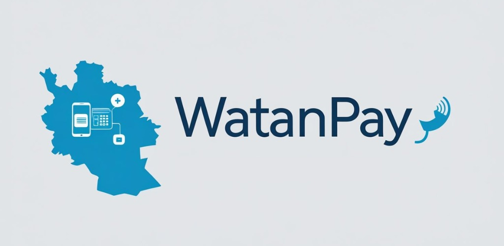
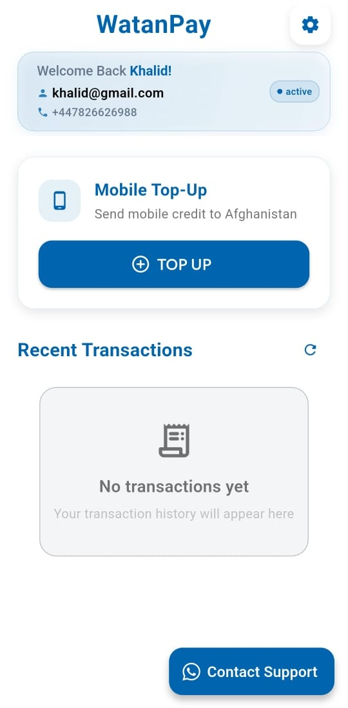
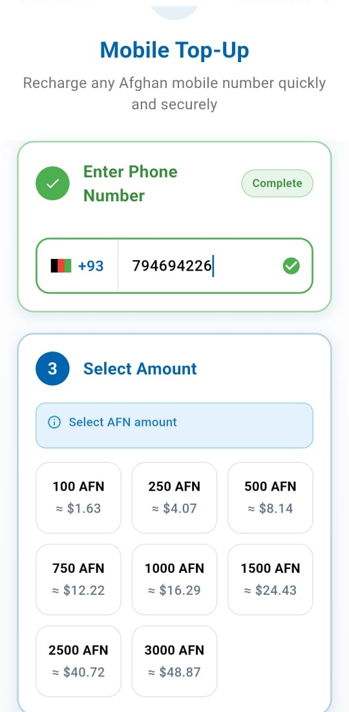
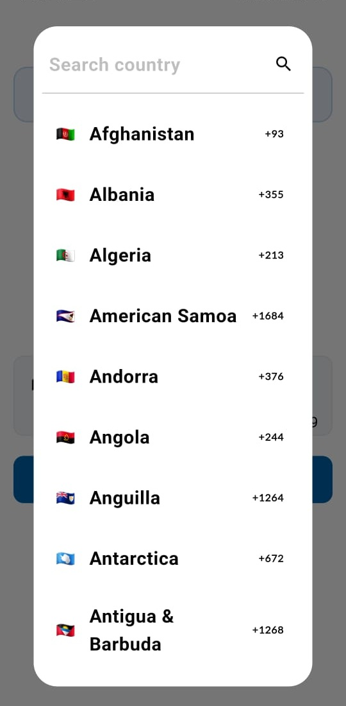

# Hexagone Projects

### About this Repository

This repository contains a collection of projects we have built across industries including e-commerce, fintech, travel, education, healthcare, IoT, and lifestyle.

  

---

## 📋 Contents

| # | Project | Categories |
|:---:|:----------|:------------|
| 1 | [🥗 Green Eats – Grocery App](#-green-eats--grocery-app) | Mobile App, Website |
| 2 | [🌍 Roame – Tour Planning App](#-roame--tour-planning-app) | Mobile App |
| 3 | [🎓 My NUST – University App](#-my-nust--university-app) | Mobile App |
| 4 | [💸 WatanPay – International Top-Ups](#-watanpay--international-top-ups) | Mobile App |
| 5 | [💬 WDYT – Opinion Sharing App](#-wdyt--opinion-sharing-app) | Mobile App |
| 6 | [🌱 Mindful Life – AI Chatbot App](#-mindful-life--ai-chatbot-app) | Mobile App |
| 7 | [🎬 Movilar – Movie & Messaging App](#-movilar--movie--messaging-app) | Mobile App |
| 8 | [💧 Water Flow – IoT Water Monitoring](#-water-flow--iot-water-monitoring) | Mobile App |
| 9 | [📚 Your Bridge School – Learning App](#-your-bridge-school--learning-app) | Mobile App |
| 10 | [🎮 Battlegrands – Tournaments App](#-battlegrands--tournaments-app) | Mobile App |
| 11 | [🏗 Ez Build – Online Marketplace MVP](#-ez-build--online-marketplace-mvp) | Mobile App |
| 12 | [🐶 Dog Alert – Smart Pet Tracking](#-dog-alert--smart-pet-tracking) | Mobile App, IoT |
| 13 | [🌙 Sleep – Sound Therapy App](#-sleep--sound-therapy-app) | Mobile App, IoT |

---

## 🥗 Green Eats – Grocery App

`Mobile App` `Website`

**Green Eats is a cross-platform meal delivery ecosystem with apps for Android, iOS, and Web.**

user android/ios app, website, ride app, chef app, admin panel

  
  
  

### Tech Stack

  <code>Flutter</code>
  <code>Firebase</code>
  <code>vercel</code>

### Features

- Flutter front-end, Firebase authentication, Firestore, hosting, notifications, cloud functions, admin panel.
- Digitized grocery operations for local retailers, reduced manual overhead, improved customer retention with real-time updates.

### Screenshots

<table align="center">
  <tr>
    <td align="center"></td>
    <td align="center"></td>
  </tr>
  <tr>
    <td align="center"></td>
    <td align="center"></td>
  </tr>
  <tr>
    <td align="center"></td>
    <td align="center"></td>
  </tr>
</table>

## 🌍 Roame – Tour Planning App

`Mobile App`

**Roame is an AI-powered travel discovery and booking app.**

It connects with social media to highlight trending destinations and allows users to book hotels, restaurants, or complete trips.

### Tech Stack

  <code>PostgreSQL</code>
  <code>Flutter</code>

### Features

- Flutter + Firebase, AI-based recommendations, social media API integration, secure booking system.
- Simplified trip planning, monetization via hotel partnerships, and improved user engagement through social-driven travel discovery.

### Screenshots

<table align="center">
  <tr>
    <td align="center"></td>
    <td align="center"></td>
  </tr>
  <tr>
    <td align="center"></td>
    <td align="center"></td>
  </tr>
  <tr>
    <td align="center"></td>
    <td align="center"></td>
  </tr>
</table>

## 🎓 My NUST – University App

`Mobile App`

**My NUST is a student-focused utility app for NUST University.**

It combines academic tools and productivity features into one platform.

  

### Tech Stack

  <code>Flutter</code>
  <code>Firebase</code>

### Features

- Flutter app with animations, GPA calculator, LMS integration, reminders, secure local storage, in-app browser, PDF downloads.
- Streamlined academic management, improved student productivity, and reduced manual processes.

### Screenshots

<table align="center">
  <tr>
    <td align="center"></td>
    <td align="center"></td>
  </tr>
  <tr>
    <td align="center"></td>
    <td align="center"></td>
  </tr>
  <tr>
    <td align="center"></td>
    <td align="center"></td>
  </tr>
</table>

## 💸 WatanPay – International Top-Ups

`Mobile App`

**WatanPay is a secure mobile top-up app for sending balance to families in Afghanistan.**

It emphasizes trust, transparency, and ease of use.

  

### Tech Stack

  <code>Flutter</code>
  <code>Firebase</code>

### Features

- Flutter + Firebase, secure card saving, encrypted payments, real-time exchange rates.
- Enabled diaspora communities to support families instantly, increased trust with transparent rates, built recurring user engagement.

### Screenshots

<table align="center">
  <tr>
    <td align="center"></td>
    <td align="center"></td>
  </tr>
  <tr>
    <td align="center"></td>
    <td align="center"></td>
  </tr>
  <tr>
    <td align="center"></td>
    <td align="center"></td>
  </tr>
</table>

## 💬 WDYT – Opinion Sharing App

`Mobile App`

**WDYT (What Do You Think?) is a social opinion-sharing platform that gamifies conversations through emoji battles.**

  
  

### Tech Stack

  <code>Flutter</code>
  <code>Firebase</code>

### Features

- Flutter + Firebase, real-time user interactions, Play Store & App Store launch.
- Built global user engagement through gamification, opened monetization via ads/premium packs, and scaled as a cross-platform social tool.

### Screenshots

  
  
  
  
  
  

## 🌱 Mindful Life – AI Chatbot App

`Mobile App`

**Mindful Life is an AI well-being assistant that guides users toward healthier habits. It uses gamification (growable tree persona) and AI doctors for personalized health advice.**

### Tech Stack

  <code>Flutter</code>
  <code>Node.js</code>

### Features

- Flutter + AI chatbot integration, persona-based gamification, health-focused Q&A.
- Encouraged healthier lifestyles, increased user retention with gamification, potential for integration with digital healthcare.

### Screenshots

<table align="center">
  <tr>
    <td align="center"></td>
    <td align="center"></td>
  </tr>
  <tr>
    <td align="center"></td>
    <td align="center"></td>
  </tr>
  <tr>
    <td align="center"></td>
    <td align="center"></td>
  </tr>
</table>

## 🎬 Movilar – Movie & Messaging App

`Mobile App`

**Movilar is a movie discovery and messaging platform. It supports offline browsing and real-time communication between users.**

### Tech Stack

  <code>Flutter</code>
  <code>PostgreSQL</code>

### Features

- Flutter + SQLite offline caching, MQTT chat integration, movie API connection.
- Enhanced entertainment experience with offline usability and built-in messaging, paving the way for community-driven engagement.

### Screenshots

<table align="center">
  <tr>
    <td align="center"></td>
    <td align="center"></td>
  </tr>
  <tr>
    <td align="center"></td>
    <td align="center"></td>
  </tr>
  <tr>
    <td align="center"></td>
    <td align="center"></td>
  </tr>
</table>

## 💧 Water Flow – IoT Water Monitoring

`Mobile App`

**Water Flow is a smart IoT water-level monitoring app. It tracks usage, provides monthly trends, sends alerts, and allows remote valve control.**

### Tech Stack

  <code>Flutter</code>
  <code>Firebase</code>
  <code>ESP32</code>

### Features

- Flutter app with IoT device integration, geo-fencing alerts, notifications, remote valve control.
- Helped households conserve resources, improved safety through alerts, showcased IoT–Flutter synergy for utilities.

### Screenshots

<table align="center">
  <tr>
    <td align="center"></td>
    <td align="center"></td>
  </tr>
  <tr>
    <td align="center"></td>
    <td align="center"></td>
  </tr>
  <tr>
    <td align="center"></td>
    <td align="center"></td>
  </tr>
</table>

## 📚 Your Bridge School – Learning App

`Mobile App`

**Your Bridge School (YBS) is a custom learning app for students. It offers structured lessons, units, and audio-based learning, with admin-controlled content management.**

  
  

### Tech Stack

  <code>Firebase</code>
  <code>Flutter</code>

### Features

- Flutter + Firebase, admin controls for locking/unlocking units, audio-enabled learning modules.
- Improved accessibility for students, empowered admins with flexible content updates, enhanced engagement with multimedia lessons.

### Screenshots

<table align="center">
  <tr>
    <td align="center"></td>
    <td align="center"></td>
  </tr>
  <tr>
    <td align="center"></td>
    <td align="center"></td>
  </tr>
  <tr>
    <td align="center"></td>
    <td align="center"></td>
  </tr>
</table>

## 🎮 Battlegrands – Tournaments App

`Mobile App`

**Battlegrands is a competitive gaming platform where users can join or host tournaments and challenges.**

### Tech Stack

  <code>Firebase</code>
  <code>Firebase</code>

### Features

- Flutter app with Firebase backend, leaderboard & challenge system.
- Fostered community-driven gaming, opened monetization opportunities through tournament fees and sponsorships.

### Screenshots

<table align="center">
  <tr>
    <td align="center"></td>
    <td align="center"></td>
  </tr>
  <tr>
    <td align="center"></td>
    <td align="center"></td>
  </tr>
  <tr>
    <td align="center"></td>
    <td align="center"></td>
  </tr>
</table>

## 🏗 Ez Build – Online Marketplace MVP

`Mobile App`

**Ez Build is an MVP for an online buying & selling platform. It enables quick transactions and validates the marketplace model.**

  

### Tech Stack

  <code>Firebase</code>
  <code>Flutter</code>

### Features

- Flutter + Firebase MVP build, lightweight architecture.
- Helped validate business model, created a foundation for scaling into a full-featured marketplace.

### Screenshots

<table align="center">
  <tr>
    <td align="center"></td>
    <td align="center"></td>
  </tr>
  <tr>
    <td align="center"></td>
    <td align="center"></td>
  </tr>
  <tr>
    <td align="center"></td>
    <td align="center"></td>
  </tr>
</table>

## 🐶 Dog Alert – Smart Pet Tracking

`Mobile App` `IoT`

**Dog Alert is an IoT-based pet safety app that tracks location, detects digging, and allows custom shock control for dogs.**

### Tech Stack

  <code>Firebase</code>
  <code>Firebase</code>
  <code>ESP32</code>

### Features

- Flutter + IoT tracking, real-time location monitoring, smart alerts.
- Improved pet safety, provided peace of mind for owners, showcased innovative IoT use in pet care.

### Screenshots

<table align="center">
  <tr>
    <td align="center"></td>
    <td align="center"></td>
  </tr>
  <tr>
    <td align="center"></td>
    <td align="center"></td>
  </tr>
  <tr>
    <td align="center"></td>
    <td align="center"></td>
  </tr>
</table>

## 🌙 Sleep – Sound Therapy App

`Mobile App` `IoT`

**Sleep is a relaxation app that plays therapeutic sounds to help users improve sleep quality and manage insomnia.**

### Tech Stack

  <code>Flutter</code>
  <code>Firebase</code>

### Features

- Flutter app with curated audio library, smooth playback.
- Supported mental well-being, improved sleep quality for users, demonstrated potential in digital therapy solutions.

### Screenshots

<table align="center">
  <tr>
    <td align="center"></td>
    <td align="center"></td>
  </tr>
  <tr>
    <td align="center"></td>
    <td align="center"></td>
  </tr>
  <tr>
    <td align="center"></td>
    <td align="center"></td>
  </tr>
</table>

---

Last updated: December 03, 2025

