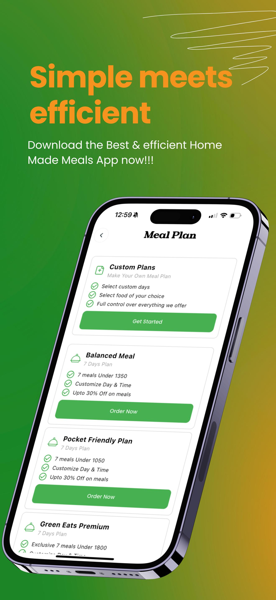

# 🚀 Flutter Projects

<h2 align="center">About this Repository</h2>  

  
This repository contains a collection of <b>Flutter projects</b> I have built across industries including <i>e-commerce, fintech, travel, education, healthcare, IoT, and lifestyle</i>.  
    
Each project is a <b>standalone, production-ready application</b> that demonstrates my expertise in Flutter, Firebase, and scalable integrations. More importantly, these apps are designed to <b>solve real-world problems</b>, improve efficiency, and create measurable <b>business value</b>.  
    
Many of these apps are <b>live on Play Store, App Store, or Web</b>, actively serving real users and businesses. Whether you need a <i>lean MVP</i> or a <i>full-scale product</i>, this portfolio highlights how I deliver <b>end-to-end solutions</b> — from architecture and integrations to design and deployment.  

  

---

<h2 align='center'>Table of Contents</h2>  

<ul>  
  <li><a href="#green-eats">Green Eats – Grocery App</a></li>  
  <li><a href="#roame">Roame – Tour Planning App</a></li>  
  <li><a href="#my-nust">My NUST – University App</a></li>  
  <li><a href="#watanpay">WatanPay – International Top-Ups</a></li>  
  <li><a href="#wdyt">WDYT – Opinion Sharing App</a></li>  
  <li><a href="#mindful-life">Mindful Life – AI Chatbot App</a></li>  
  <li><a href="#movilar">Movilar – Movie & Messaging App</a></li>  
  <li><a href="#water-flow">Water Flow – IoT Monitoring App</a></li>  
  <li><a href="#ybs">Your Bridge School – Learning App</a></li>  
  <li><a href="#ez-build">Ez Build – Online Marketplace</a></li>  
  <li><a href="#battlegrands">Battlegrands – Tournaments App</a></li>  
  <li><a href="#dog-alert">Dog Alert – Smart Pet Tracking</a></li>  
  <li><a href="#sleep">Sleep – Sound Therapy App</a></li>  
</ul>  

---

## 🥗 Green Eats – Grocery App

  
<b>Green Eats</b> is a <b>multi-platform grocery ecosystem</b> with apps for Android, iOS, and Web. It offers seamless online shopping for customers and a powerful admin panel for business owners.  

  

* **Technical Highlights:** Flutter front-end, Firebase authentication, Firestore, hosting, notifications, cloud functions, admin panel.
* **Business Impact:** Digitized grocery operations for local retailers, reduced manual overhead, improved customer retention with real-time updates.

  
    
    
    

  

  

|                                          |                                          |                                          |
| ---------------------------------------- | ---------------------------------------- | ---------------------------------------- |
|  |  |  |
|  |  |  |

---

## 🌍 Roame – Tour Planning App

  
<b>Roame</b> is an <b>AI-powered travel discovery and booking app</b>. It connects with social media to highlight trending destinations and allows users to book hotels, restaurants, or complete trips.  

  

* **Technical Highlights:** Flutter + Firebase, AI-based recommendations, social media API integration, secure booking system.
* **Business Impact:** Simplified trip planning, monetization via hotel partnerships, and improved user engagement through social-driven travel discovery.

  

|                                     |                                     |                                     |
| ----------------------------------- | ----------------------------------- | ----------------------------------- |
|  |  |  |
|  |  |  |

---

## 🎓 My NUST – University App

  
<b>My NUST</b> is a student-focused utility app for <b>NUST University</b>. It combines academic tools and productivity features into one platform.  

  

* **Technical Highlights:** Flutter app with animations, GPA calculator, LMS integration, reminders, secure local storage, in-app browser, PDF downloads.
* **Business Impact:** Streamlined academic management, improved student productivity, and reduced manual processes.

  
    
    

  

  

|                                       |                                       |                                       |
| ------------------------------------- | ------------------------------------- | ------------------------------------- |
|  |  |  |
|  |  |  |

---

## 💸 WatanPay – International Top-Ups

  
<b>WatanPay</b> is a <b>secure mobile top-up app</b> for sending balance to families in Afghanistan. It emphasizes trust, transparency, and ease of use.  

  

* **Technical Highlights:** Flutter + Firebase, secure card saving, encrypted payments, real-time exchange rates.
* **Business Impact:** Enabled diaspora communities to support families instantly, increased trust with transparent rates, built recurring user engagement.

  
    

  

  

|                                        |                                        |                                        |
| -------------------------------------- | -------------------------------------- | -------------------------------------- |
|  |  |  |
|  |  |  |

---

## 💬 WDYT – Opinion Sharing App

  
<b>WDYT</b> (What Do You Think?) is a <b>social opinion-sharing platform</b> that gamifies conversations through emoji battles.  

  

* **Technical Highlights:** Flutter + Firebase, real-time user interactions, Play Store & App Store launch.
* **Business Impact:** Built global user engagement through gamification, opened monetization via ads/premium packs, and scaled as a cross-platform social tool.

  
    
    

  

  

|                                    |                                    |                                    |
| ---------------------------------- | ---------------------------------- | ---------------------------------- |
|  |  |  |
|  |  |  |

---

## 🌱 Mindful Life – AI Chatbot App

  
<b>Mindful Life</b> is an <b>AI well-being assistant</b> that guides users toward healthier habits. It uses gamification (growable tree persona) and AI doctors for personalized health advice.  

  

* **Technical Highlights:** Flutter + AI chatbot integration, persona-based gamification, health-focused Q\&A.
* **Business Impact:** Encouraged healthier lifestyles, increased user retention with gamification, potential for integration with digital healthcare.

  

|                                            |                                            |                                            |
| ------------------------------------------ | ------------------------------------------ | ------------------------------------------ |
|  |  |  |
|  |  |  |

---

## 🎬 Movilar – Movie & Messaging App

  
<b>Movilar</b> is a <b>movie discovery and messaging platform</b>. It supports offline browsing and real-time communication between users.  

  

* **Technical Highlights:** Flutter + SQLite offline caching, MQTT chat integration, movie API connection.
* **Business Impact:** Enhanced entertainment experience with offline usability and built-in messaging, paving the way for community-driven engagement.

  

|                                       |                                       |                                       |
| ------------------------------------- | ------------------------------------- | ------------------------------------- |
|  |  |  |
|  |  |  |

---

## 💧 Water Flow – IoT Water Monitoring

  
<b>Water Flow</b> is a smart <b>IoT water-level monitoring app</b>. It tracks usage, provides monthly trends, sends alerts, and allows remote valve control.  

  

* **Technical Highlights:** Flutter app with IoT device integration, geo-fencing alerts, notifications, remote valve control.
* **Business Impact:** Helped households conserve resources, improved safety through alerts, showcased IoT–Flutter synergy for utilities.

  
    

  

  

|                                          |                                          |                                          |
| ---------------------------------------- | ---------------------------------------- | ---------------------------------------- |
|  |  |  |
|  |  |  |

---

## 📚 Your Bridge School – Learning App

  
<b>Your Bridge School (YBS)</b> is a <b>custom learning app</b> for students. It offers structured lessons, units, and audio-based learning, with admin-controlled content management.  

  

* **Technical Highlights:** Flutter + Firebase, admin controls for locking/unlocking units, audio-enabled learning modules.
* **Business Impact:** Improved accessibility for students, empowered admins with flexible content updates, enhanced engagement with multimedia lessons.

  
    

  

  

|                                   |                                   |                                   |
| --------------------------------- | --------------------------------- | --------------------------------- |
|  |  |  |
|  |  |  |

---

## 🏗 Ez Build – Online Marketplace MVP

  
<b>Ez Build</b> is an MVP for an <b>online buying & selling platform</b>. It enables quick transactions and validates the marketplace model.  

  

* **Technical Highlights:** Flutter + Firebase MVP build, lightweight architecture.
* **Business Impact:** Helped validate business model, created a foundation for scaling into a full-featured marketplace.

  
    

  

  

|                                        |                                        |                                        |
| -------------------------------------- | -------------------------------------- | -------------------------------------- |
|  |  |  |
|  |  |  |

---

## 🎮 Battlegrands – Tournaments App

  
<b>Battlegrands</b> is a <b>competitive gaming platform</b> where users can join or host tournaments and challenges.  

  

* **Technical Highlights:** Flutter app with Firebase backend, leaderboard & challenge system.
* **Business Impact:** Fostered community-driven gaming, opened monetization opportunities through tournament fees and sponsorships.

  

|                                            |                                            |                                            |
| ------------------------------------------ | ------------------------------------------ | ------------------------------------------ |
|  |  |  |
|  |  |  |

---

## 🐶 Dog Alert – Smart Pet Tracking

  
<b>Dog Alert</b> is an IoT-based <b>pet safety app</b> that tracks location, detects digging, and allows custom shock control for dogs.  

  

* **Technical Highlights:** Flutter + IoT tracking, real-time location monitoring, smart alerts.
* **Business Impact:** Improved pet safety, provided peace of mind for owners, showcased innovative IoT use in pet care.

|                                         |                                         |                                         |
| --------------------------------------- | --------------------------------------- | --------------------------------------- |
|  |  |  |
|  |  |  |

---

## 🌙 Sleep – Sound Therapy App

  
<b>Sleep</b> is a <b>relaxation app</b> that plays therapeutic sounds to help users improve sleep quality and manage insomnia.  

  

* **Technical Highlights:** Flutter app with curated audio library, smooth playback.
* **Business Impact:** Supported mental well-being, improved sleep quality for users, demonstrated potential in digital therapy solutions.

|                                     |                                     |                                     |
| ----------------------------------- | ----------------------------------- | ----------------------------------- |
|  |  |  |
|  |  |  |

---

 